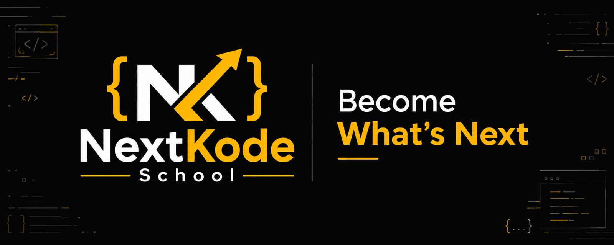

<!-- LOGO -->

---

# 🎯 Who We Are

NextKode School is a community-driven learning platform helping students, freshers, and working professionals build real-world technology skills through practical learning, mentorship, and industry-focused guidance.

We don't just teach technology.

**We help you become what's next.**

---

# 🚀 What You'll Master

<table>
<tr>

<td align="center" width="25%">

### ♾️ DevOps Engineering

Modern Software Delivery

Automation

Infrastructure Management

Scalable Systems

</td>

<td align="center" width="25%">

### ☁️ Multi-Cloud Engineering

Cloud Architecture

Deployment Strategies

Cloud Operations

Enterprise Platforms

</td>

<td align="center" width="25%">

### 🤖 Generative AI Engineering

Large Language Models

AI Applications

Knowledge Systems

Real-world AI Projects

</td>

<td align="center" width="25%">

### ⚡ AI Agents & Automation

Autonomous Workflows

Business Automation

Tool Integrations

Agent Development

</td>

</tr>
</table>

---

# 👨‍🎓 Who Can Learn?

✅ Beginners

✅ Students & Freshers

✅ Working Professionals

✅ Career Switchers

---

# 🌟 Beyond Training

* 🎯 Career-Focused Learning
* 🧑‍🏫 Expert Mentorship
* 🤝 Community Support
* 💼 Professional Growth Guidance
* 🚀 Real-World Projects
* 📈 Continuous Learning

---

# 🎓 How You Learn With Us

| Learning Experience   | Description                             |
| --------------------- | --------------------------------------- |
| 💻 Online Training    | Interactive live sessions               |
| 🛠 Workshops          | Practical implementation sessions       |
| 🤝 Community Learning | Learn together and grow together        |
| 🌐 Offline Meetups    | Networking and collaboration            |
| 📚 Learning Resources | Continuous access to learning materials |
| 🚀 Career Growth      | Guidance beyond the classroom           |

---

# 📈 Daily Learning. Daily Growth.

Join our community and receive:

* Daily Technology Insights
* Industry Best Practices
* Interview Preparation
* Career Guidance
* Real-World Learning
* Practical Tips & Tricks
* Community Discussions

---

# 🌍 Join Our Community

### Website

https://nextkodeschool.com

### Telegram

https://t.me/nextkodeschool

### Instagram

https://instagram.com/nextkodeschool

### LinkedIn

https://linkedin.com/company/nextkodeschool

### YouTube

https://youtube.com/@nextkodeschool

### GitHub

https://github.com/nextcodeschool

---

# 🚀 Learn. Practice. Grow.

## Become What's Next

